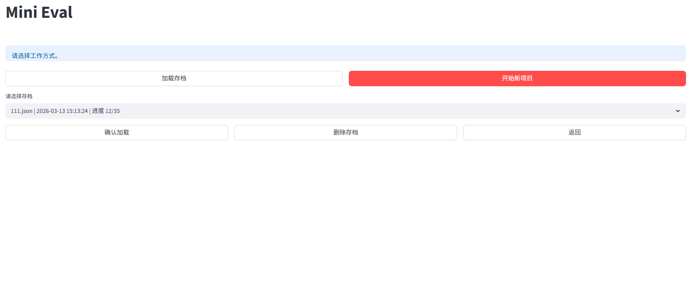
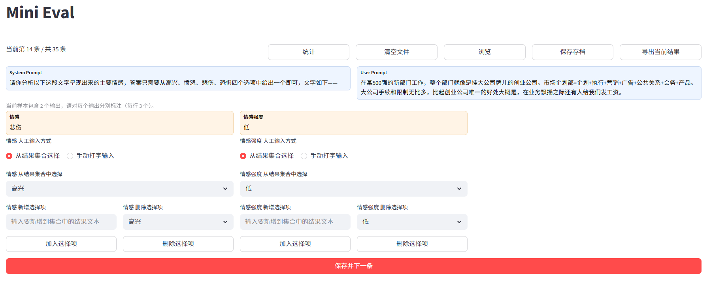
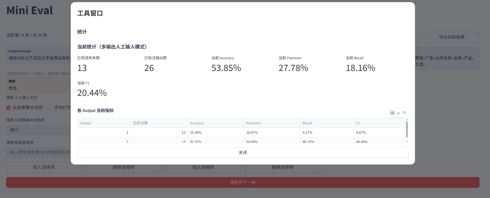
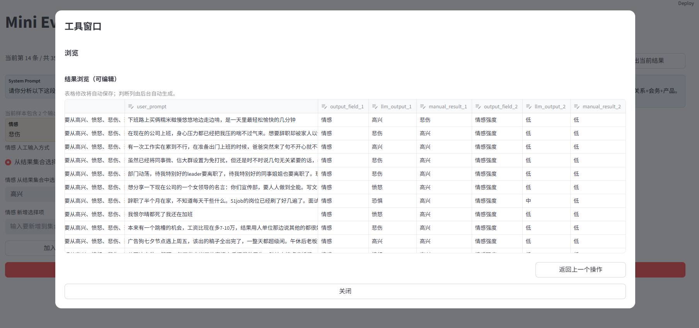
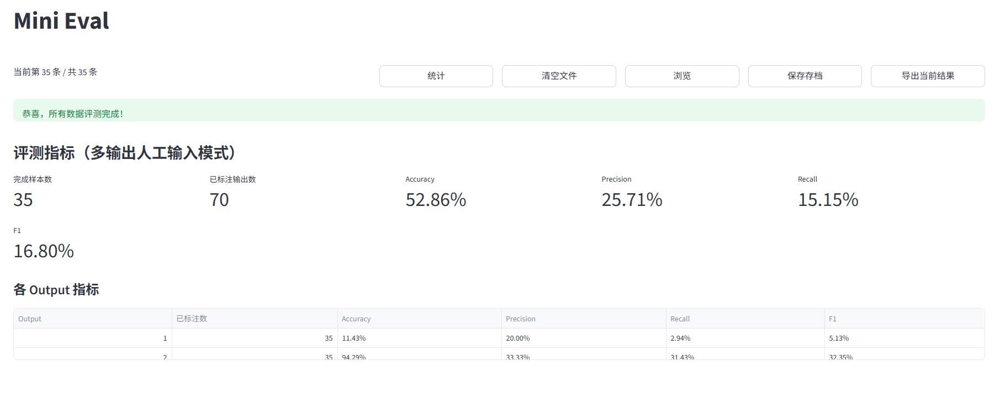
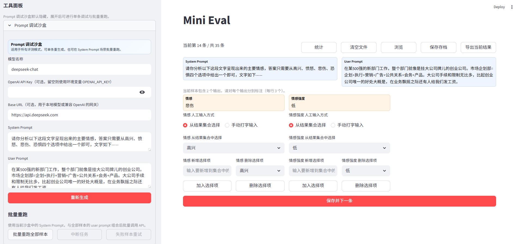

# Mini Eval


轻量级 LLM 文本结果标注与评测工具，支持多评测模式、存档续评、结果浏览修订与导出。


A lightweight LLM annotation and evaluation tool with multiple evaluation modes, archive resume, editable result browsing, and export support.


我的联系方式在[我的个人网页](https://xiaoyizhang833.github.io/)中

You can get my e-mail address from [here](https://xiaoyizhang833.github.io/)

## 中文说明


### 功能亮点


- Excel 导入与字段映射：支持 Prompt + 单/多 Output。

- 多评测模式：

  - 直接判断（采纳/拒绝）

  - 人工输入（选项选择/手动输入）

  - 多输出逐项标注

- 统计面板：支持评测中与完成后的指标查看。

- 浏览修订：支持在浏览窗口中直接编辑结果，自动保存并支持返回上一步。

- 存档系统：

  - 初始页支持“加载存档 / 开始新项目”

  - 评测页支持“保存存档”

  - 支持自定义存档名与同名覆盖确认

  - 支持删除存档

- 导出能力：支持导出当前结果（Excel）。

- 轻量化：包依赖关系极少，部署难度低。

- 本地运行：所有数据均在本地（除了软件内调试prompt会将数据发给大模型供应商），安全感拉满。

- prompt实时修改：能在软件内优化prompt并查看结果


### 环境要求


- Python 3.10+

- Windows / macOS / Linux


### 安装依赖


```bash

pip install -r requirements.txt

```


### 运行方式


```bash

streamlit run app.py

```


### 目录结构


```text

software/

├─ app.py                  # 应用入口

├─ evaluation_view.py      # 主评测页面逻辑

├─ sandbox_view.py         # 侧边栏调试沙盒

├─ session_state_utils.py  # 会话状态管理

├─ excel_utils.py          # Excel 读取与字段映射

├─ metrics_utils.py        # 指标计算

├─ archives/               # 存档目录

├─ example.xlsx            # 示例数据

└─ requirements.txt

```


### 使用流程


1. 打开应用后选择“加载存档”或“开始新项目”。
2. 在左侧边栏顶部切换语言（中文 / English）。
3. 新项目场景下导入 Excel，并完成字段映射。
4. 选择评测模式并开始标注。
5. 可随时通过顶部按钮进行统计、浏览、保存存档、导出当前结果。
6. 下次可从初始化页面加载存档继续。


### 产品界面/ Interface









---


## English


### Overview


Mini Eval is a lightweight Streamlit app for LLM output annotation and quality evaluation.

It supports single-output and multi-output workflows, manual correction, archive resume, and Excel export.


### Key Features


- Excel import with field mapping (Prompt + one/multiple Outputs)

- Multiple evaluation modes:

  - Direct decision (accept/reject)

  - Manual input (select from pool / free typing)

  - Per-output annotation for multi-output samples

- Live and final metrics panels

- Editable browsing dialog with auto-save and one-step undo

- Archive system:

  - Load archive / start new project entry

  - Save checkpoints anytime during evaluation

  - Custom archive filename and overwrite confirmation

  - Archive deletion on entry page

- Export current results to Excel

- Refresh protection to reduce accidental progress loss


### Requirements


- Python 3.10+

- Streamlit-compatible environment


### Install


```bash

pip install -r requirements.txt

```


### Run


```bash

streamlit run app.py

```


### Quick Start


1. Choose Load Archive or Start New Project on the entry page.
2. Switch language from the top of the left sidebar (中文 / English).
3. For a new project, import Excel and complete field mapping.
4. Select an evaluation mode and start annotation.
5. Use top actions for stats, browse/edit, save archive, and export.
6. Resume anytime from archives.


## License


For internal use or custom licensing as needed.


